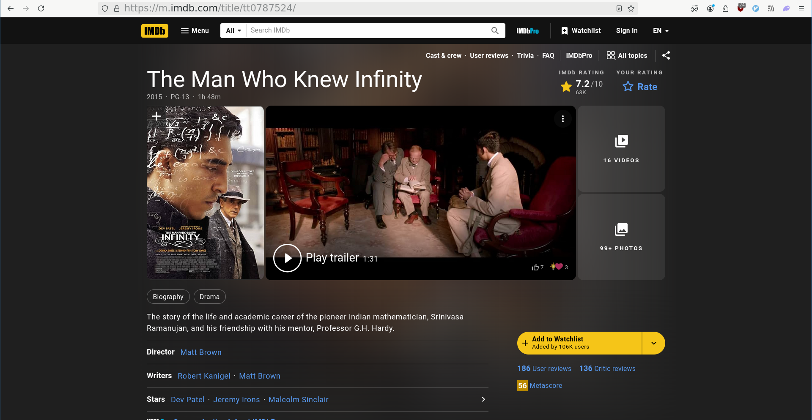

# keylogger_gpt

Send screenshot to openai gpt-4o to get informations visible on screen 

## Usage

``` sh
# Take a fullscreen screenshot
flameshot full -p /home/alx/org/inbox/screenshots/$(date +"%Y-%m-%d_%H-%M-%S").png

# Process screenshot
#   - url in clipboard
#   - org-mode item in /home/alx/org/inbox_screenshot.org
python3 /home/alx/code/keylogger_gpt/main.py
```

## Installation

1. setup OpenAI `API_key` in `main.py`
2. change `inbox_path`, `outbox_path` and `output_file` paths
3. `pip install -r requirements.txt`

## Example

### screenshot



### json

``` json
{
"url": "https://m.imdb.com/title/tt0787524/",
"title": "The Man Who Knew Infinity (2015) - IMDb",
"description": "The story of the life and academic career of Srinivasa Ramanujan and his friendship with G.H. Hardy.",
"tag_list": ["ia", "comp", "book"]
}

```

### org-mode item

``` org
** [[https://m.imdb.com/title/tt0787524/][The Man Who Knew Infinity (2015) - IMDb]] :ia:comp:book:
:PROPERTIES:
:CREATED: [2024-10-25 Fri 11:26]
:END:

[[./assets/2024-10-25_11-26-38.png]]

The story of the life and academic career of Srinivasa Ramanujan and his friendship with G.H. Hardy.
```
